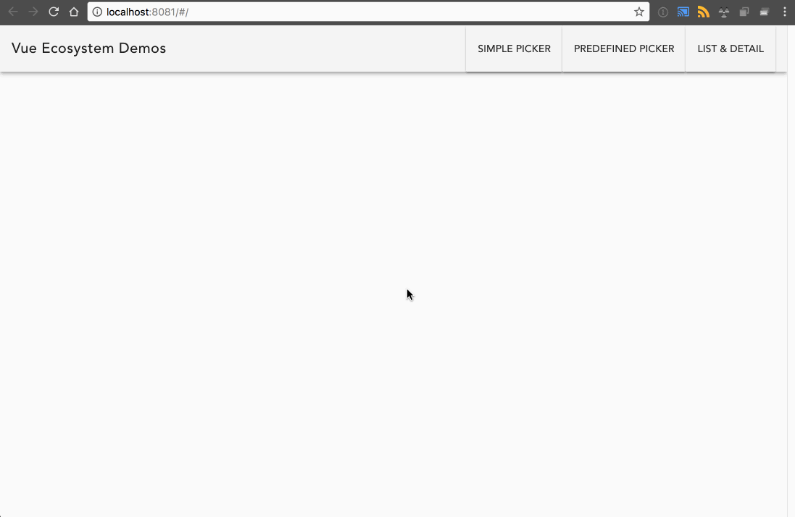

# the-vue-js-ecosystem

> Examples for my talk on the Vue.js ecosystem.



These are most the demos I will be showing at my [jSTL talk on the Vue.js Ecosystem](https://www.meetup.com/jstl-meetup/events/246372420/). The master branch has everything put together, but the individual demos can be found under the branches:

* color-picker-demo
* mvvm-demo
* simple-shared-state-demo
* vue-router demo

The vuex example I will be showing is from a closed-source work project so I can't share it (though we may end up open sourcing it one day ;) ).

[The associated slide deck can be found here](https://docs.google.com/presentation/d/1jOtcqqUPxPzFwDZWllcNsVeaelOdXOwFl8giUcXbBjg/edit?usp=sharing). I believe we'll be recording the talk and if we do I'll post the link here as well.

## Build Setup

```bash
# install dependencies
npm install

# serve with hot reload at localhost:8080
npm run dev

# build for production with minification
npm run build
```
